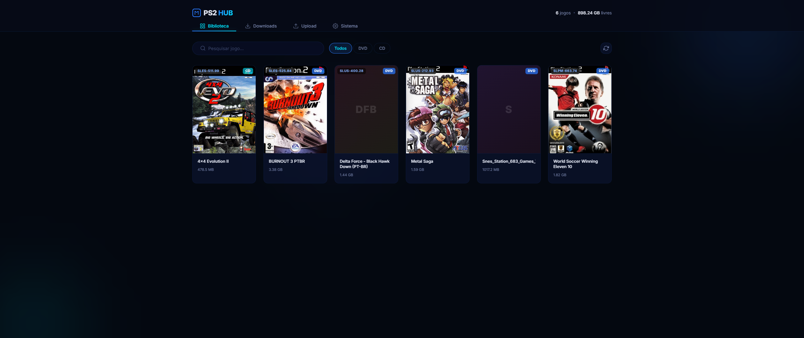

# PS2 Hub


Um gerenciador web completo para organizar e gerenciar seus jogos e arquivos do PlayStation 2 via rede (SMB/OPL). 
**Atenção:** No momento, este projeto oferece suporte **somente para ambientes Linux (Ubuntu/Debian)**.

## 📋 Funcionalidades
- Interface web moderna para listar e visualizar sua biblioteca do PS2.
- Upload de arquivos de jogos via navegador em partes (chunked uploads) para evitar limites de tamanho.
- Suporte a download de jogos via links com integração ao `aria2c`.
- Extração de arquivos `.zip`, `.rar` e `.7z` automatizada em segundo plano.
- Processamento automático da ISO: Lê o ID do jogo do arquivo binário e renomeia automaticamente (ex: `SLUS_200.44.Jogo.iso`).
- Suporte a retentativa de extração protegida por senhas.

---

## 🛠 Pré-requisitos (Instalação do Sistema)

Você precisará instalar as seguintes ferramentas de sistema no seu servidor/computador Linux (Ubuntu):

```bash
# Atualize os pacotes
sudo apt update

# Instale o Python 3 e o gerenciador de pacotes pip
sudo apt install python3 python3-pip python3-venv

# Instale o aria2 (usado para baixar arquivos pela web via RPC)
sudo apt install aria2

# Instale o p7zip (usado para descompactar .7z, .rar e .zip)
sudo apt install p7zip-full p7zip-rar
```

---

## 🚀 Instalação e Execução do Projeto

1. **Clone ou acesse a pasta do projeto.**
2. **Crie e ative um ambiente virtual Python:**
   ```bash
   python3 -m venv venv
   source venv/bin/activate
   ```
3. **Instale as dependências do Python:**
   ```bash
   pip install -r requirements.txt
   ```
   *(O projeto usa `Flask`, `requests` e `psutil`)*

4. **Inicie o serviço do Aria2:**
   O projeto requer que o `aria2c` esteja rodando em modo RPC.
   ```bash
   aria2c --enable-rpc --rpc-listen-all=false --rpc-listen-port=6800 --rpc-secret=ps2hub -D
   ```
5. **Inicie a aplicação PS2 Hub:**
   ```bash
   python run.py
   ```
   O servidor estará disponível por padrão na porta `5000` (acesse via `http://localhost:5000` no seu navegador).

---

## ⚙ Configurações e Variáveis de Ambiente

O PS2 Hub é altamente configurável usando variáveis de ambiente. Elas podem ser exportadas no terminal antes de rodar a aplicação:

| Variável | Descrição | Valor Padrão |
|----------|-----------|--------------|
| `PS2_ROOT` | O diretório principal (HD) onde seus jogos do OPL ficam armazenados. O sistema irá buscar as pastas `DVD`, `CD`, `ART`, etc. | `/srv/ps2` (Se a pasta não existir, usará `./data` local) |
| `ARIA2_RPC_URL` | Endereço do RPC do aria2. | `http://localhost:6800/jsonrpc` |
| `ARIA2_RPC_SECRET`| Senha secreta de conexão do RPC do aria2. | `ps2hub` |
| `SECRET_KEY` | Chave de segurança para sessões do Flask. É recomendado mudar em produção. | `dev-key-change-in-production` |

Exemplo de como iniciar personalizando o diretório do PS2:
```bash
export PS2_ROOT="/mnt/hd_externo_ps2"
python run.py
```

## 📂 Estrutura de Pastas Esperada

Com base no diretório apontado pela variável `PS2_ROOT`, o PS2 Hub espera/cria automaticamente a estrutura base do OPL:
- `DVD/` - Imagens de jogos ISOs maiores que 700MB.
- `CD/` - Imagens de jogos menores que 700MB.
- `ART/` - Capas e artes do jogo.
- `downloads/` - Pasta temporária para o aria2c colocar os downloads em andamento, e para `temp_uploads` (chunks do navegador).
- `titles/` - Banco de dados ou lista para identificar nomes reais de jogos com base na ID do arquivo (ex: `SLUS_xxx.xx`).
